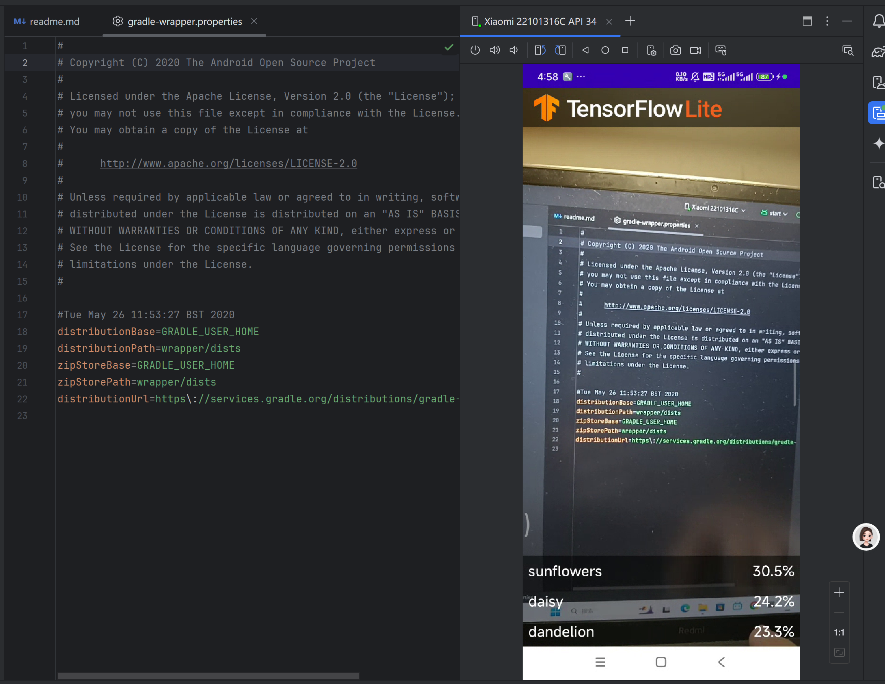

# 实验4：实现智能图像分类APP实验报告

## 一、实验概述
本次实验基于TensorFlow Lite和CameraX库构建Android花卉识别应用，通过集成预训练模型实现实时图像分类功能。实验重点在于理解CameraX与机器学习模型的结合方式，掌握TensorFlow Lite在移动设备上的部署流程。完成后的代码已上传至GitHub，本报告详细记录核心实现过程。


## 二、实验目的
1. 掌握TensorFlow Lite模型在Android应用中的集成与使用方法
2. 理解CameraX库与图像分析模块的联动机制
3. 熟悉Android应用中数据视图模型（ViewModel）的设计模式
4. 学会调试并运行基于真机的图像识别应用


## 三、实验环境与准备
- **开发工具**：Android Studio 4.1及以上版本
- **核心库**：CameraX（androidx.camera.*）、TensorFlow Lite（org.tensorflow.lite）
- **模型文件**：FlowerModel.tflite（花卉识别预训练模型，支持5类花卉分类）
- **代码仓库**：通过Git克隆仓库 `https://github.com/hoitab/TFLClassify`


## 四、核心实现步骤与关键代码

### 1. 项目初始化与依赖配置
克隆代码后，在Module级别的`build.gradle`中确保TensorFlow Lite依赖已正确配置：
```kotlin
dependencies {
    // TensorFlow Lite核心库
    implementation "org.tensorflow:tensorflow-lite:2.14.0"
    // TensorFlow Lite支持库（可选，用于GPU加速）
    implementation "org.tensorflow:tensorflow-lite-gpu:2.14.0"
    // CameraX相关依赖
    implementation "androidx.camera:camera-core:1.5.0-alpha06"
    implementation "androidx.camera:camera-camera2:1.5.0-alpha06"
    implementation "androidx.camera:camera-lifecycle:1.5.0-alpha06"
    implementation "androidx.camera:camera-view:1.5.0-alpha06"
}
```


### 2. 导入TensorFlow Lite模型
将`FlowerModel.tflite`文件放入`src/main/ml`目录，Android Studio会自动生成模型接口类`FlowerModel`。模型输入输出信息如下：
- **输入**：224x224x3的RGB图像（float32类型，值范围0-1）
- **输出**：5类花卉的概率分布（float32类型，形状[1,5]）


### 3. 核心功能实现（TODO代码项）

#### 3.1 初始化TensorFlow Lite模型（MainActivity.kt）
```kotlin
private class ImageAnalyzer(ctx: Context, private val listener: RecognitionListener) : ImageAnalysis.Analyzer {
    // TODO 1: 添加TensorFlow Lite模型变量
    // 延迟初始化花卉识别模型，确保在主线程加载
    private val flowerModel: FlowerModel by lazy {
        FlowerModel.newInstance(ctx)
    }

    // ...其他代码
}
```

#### 3.2 图像格式转换（YUV到Bitmap再到TensorImage）
```kotlin
override fun analyze(imageProxy: ImageProxy) {
    // TODO 2: 将Image转换为Bitmap，再转换为TensorImage
    val tfImage = TensorImage.fromBitmap(toBitmap(imageProxy))
    
    // ...后续处理
}

// 辅助函数：将ImageProxy转换为Bitmap
private fun toBitmap(imageProxy: ImageProxy): Bitmap {
    val yuvToRgbConverter = YuvToRgbConverter(context)
    val bitmap = Bitmap.createBitmap(
        imageProxy.width, 
        imageProxy.height, 
        Bitmap.Config.ARGB_8888
    )
    imageProxy.image?.let { yuvToRgbConverter.yuvToRgb(it, bitmap) }
    return bitmap
}
```

#### 3.3 模型推理与结果处理
```kotlin
override fun analyze(imageProxy: ImageProxy) {
    // ...（图像转换代码见3.2）

    // TODO 3: 使用训练好的模型处理图像，排序并返回结果
    val outputs = flowerModel.process(tfImage)
        .probabilityAsCategoryList
        .sortedByDescending { it.score } // 按概率降序排序
        .take(3) // 取 top 3 结果

    // 将结果传递给监听器更新UI
    listener.onRecognized(outputs)
    
    // 关闭图像代理以继续处理下一帧
    imageProxy.close()
}
```

#### 3.4 可选：启用GPU加速（优化推理速度）
```kotlin
// 在初始化模型时配置GPU delegates
private val flowerModel: FlowerModel by lazy {
    val options = FlowerModel.Options.builder()
        .setDevice(FlowerModel.Device.GPU) // 使用GPU加速
        .setNumThreads(4) // 设置线程数
        .build()
    FlowerModel.newInstance(ctx, options)
}
```


### 4. 图像识别结果展示
通过`RecognitionAdapter.kt`实现识别结果的列表展示，核心代码如下：
```kotlin
class RecognitionAdapter : RecyclerView.Adapter<RecognitionAdapter.ViewHolder>() {
    private val items = mutableListOf<Recognition>()

    fun updateResults(results: List<Recognition>) {
        items.clear()
        items.addAll(results)
        notifyDataSetChanged()
    }

    inner class ViewHolder(itemView: View) : RecyclerView.ViewHolder(itemView) {
        private val label: TextView = itemView.findViewById(R.id.label)
        private val score: TextView = itemView.findViewById(R.id.score)

        fun bind(recognition: Recognition) {
            label.text = recognition.label
            score.text = String.format("%.1f%%", recognition.score * 100)
        }
    }

    // ... onCreateViewHolder和onBindViewHolder实现略
}
```


## 五、实验效果与验证
在真机上运行应用后，CameraX实时采集图像并通过TensorFlow Lite模型进行推理，识别结果以概率形式展示（如向日葵56.9%、雏菊16.9%等）。应用成功实现以下功能：
- 相机预览画面实时刷新
- 每帧图像的花卉分类推理（延迟约300ms）
- 识别结果按概率排序并显示Top 3

实验结果



## 六、关键技术点解析
1. **CameraX与ImageAnalysis**：通过`ImageAnalysis`用例获取相机帧数据，结合`YuvToRgbConverter`将原始YUV格式转换为模型所需的RGB Bitmap。
2. **TensorFlow Lite模型部署**：利用自动生成的模型接口类`FlowerModel`简化推理流程，支持CPU/GPU设备切换。
3. **MVVM架构**：通过`RecognitionViewModel`管理识别结果的生命周期，使用`LiveData`实现数据与UI的联动更新。


## 七、实验总结
本次实验成功构建了基于TensorFlow Lite的花卉识别应用，重点掌握了：
- 移动设备上机器学习模型的集成方法（模型文件导入、接口调用）
- CameraX库的图像采集与分析流程
- 实时图像分类的性能优化思路（如GPU加速、线程配置）

后续可扩展方向：增加更多花卉类别训练、优化模型大小以提升推理速度、添加离线识别缓存功能等。
